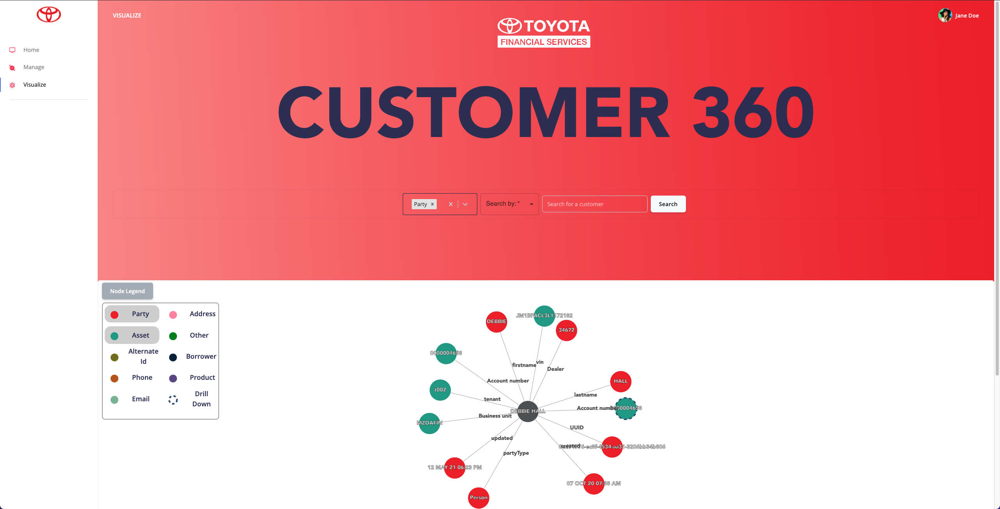
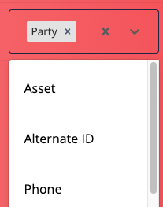
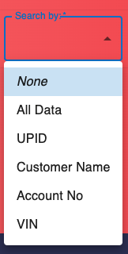

<!-- PROJECT LOGO -->
<br />
<div align="center">
    
</div>

<!-- TABLE OF CONTENTS -->
<details>
  <summary>Table of Contents</summary>
  <ol>
    <li>
      <a href="#about-the-project">About The Project</a>
      <ul>
        <li><a href="#built-with">Built With</a></li>
      </ul>
    </li>
    <li>
      <a href="#getting-started">Getting Started</a>
      <ul>
        <li><a href="#prerequisites">Prerequisites</a></li>
        <li><a href="#installation">Installation</a></li>
      </ul>
    </li>
    <li><a href="#usage">Usage</a></li>
    <li><a href="#contributing">Contributing</a></li>
    <li><a href="#contact">Contact</a></li>
  </ol>
</details>

<!-- ABOUT THE PROJECT -->

## About The Project

<div align="center">
    
</div>

The TFS Customer 360 team has worked with TFS to
create a Customer 360 view by harnessing the power
of graph databases, semantic queries, and graph
visualization tools. This view represents all direct and
indirect relationships that exist for a customer and will
be made available to different stakeholders in the
company to make more informed decisions and to
better identify potential opportunities.

<p align="right">(<a href="#top">back to top</a>)</p>

### Built With

The following list contains the technologies used for building the frontened of the Customer 360 TFS website:

- [React.js](https://reactjs.org/)
- [D3.js](https://d3js.org/)
- [Bootstrap](https://getbootstrap.com)
- [Axios](https://axios-http.com/docs/intro)

<p align="right">(<a href="#top">back to top</a>)</p>

<!-- GETTING STARTED -->

## Getting Started

To get a local copy up and running follow these simple example steps.

### Prerequisites

- npm
  ```sh
  npm install npm@latest -g
  ```

### Installation

1. Clone the repo
   ```sh
   git clone https://github.com/your_username_/tfscustomer360.git
   ```
2. Install NPM packages
   ```sh
   npm install
   ```

<p align="right">(<a href="#top">back to top</a>)</p>

<!-- USAGE EXAMPLES -->

## Usage

<Box m="auto">
            <ul>
              <li>
                The first dropdown for search gives you the option to select the
                type of data you want to look at. Each of these categories
                pertain to some information fields associated with the
                customer(s) in question.
                <br /> A brief description of each category can be seen at the bottom of the home page.
                <br />
                <br />
              </li>
              <div align="center">
                  
              </div>
              <li>
                Next, the search bar gives you the option to search by a few
                categories using the “Search by” drop-down: <br />
                <br />
                <div align="center">
                  
              </div>
                <ul>
                  <li>
                    All Data: The search returns all the information across all
                    categories discussed below for all the customers in our
                    database.
                    <br />
                  </li>
                  <br />
                  <li>
                    UPID: The search returns the unique customer to which this
                    Unique Party Identifier belongs.
                    <br />
                  </li>
                  <br />
                  <li>
                    Customer Name: The search returns all the customers with the
                    name mentioned. The search keyword/s should correspond to
                    the full customer’s name including the first, last, and
                    middle names <br />
                    along with any prefixes/suffixes in the name.
                    <br />
                  </li>
                  <br />
                  <li>
                    Account Number: The search returns all the customers
                    associated with the given account number.
                    <br />
                  </li>
                  <br />
                  <li>
                    VIN: The search returns all the customers associated with
                    the given Vehicle Identification Number.
                    <br />
                  </li>
                </ul>
              </li>
            </ul>
            <br />
            <li>
              Finally, you enter the search keyword corresponding to one of the
              criteria above that you selected and click search – “Voila!” you
              get a graph showing you the 360&deg; view of the profile of
              customer(s).
              <br />
            </li>
            <br />
            <br />
            Reading the Graph:
            <br />
            <br />
            <li>
              So, once you have the graph with the information corresponding to
              the categories you want to see, now what? You obviously want to
              play with the graph dynamically searching through different
              categories, <br />
              and that is where the Node Legend comes into play:
              <br />
            </li>
            <br />
            <li>
              Node Legend: You can dynamically select the categories you want to
              view in the graph by clicking the categories corresponding to the
              ones you want to see.
              <br />
            </li>
            <br />
            <li>
              Hover Over the graph to single out and highlight portions of the
              graph you want to view. Click on the Nodes to view the metadata
              regarding the node.
              <br />
            </li>
            <br />
            <li>
              In addition, you can also Drill Down on the nodes which have a
              dashed line highlighted around them. These nodes have the ability
              to open up into further categories of information. Click on these
              nodes and click on the drill down option that is prompted.
              <br />
            </li>
            <br />
            <br />
            Easy right? Get started! <br />
          </Box>

<p align="right">(<a href="#top">back to top</a>)</p>

<!-- CONTRIBUTING -->

## Contributing

We hope TFS finds our platform of great use. Please feel free to test, dissect, and build upon Customer 360.

<!-- CONTACT -->

## Contact

Griffin McPherson- g.mcpherson@tcu.edu
Rajas Nathak- rajas.nathak@tcu.edu
Tyler Jacques- t.jacques@tcu.edu
Lucas Karwal lucas.karwal@tcu.edu
Shruti Sharma- s.sharma@tcu.edu

Project Link: [https://github.com/rajasnathak/tfscustomer360](https://github.com/rajasnathak/tfscustomer360)

<p align="right">(<a href="#top">back to top</a>)</p>

<p align="right">(<a href="#top">back to top</a>)</p>
